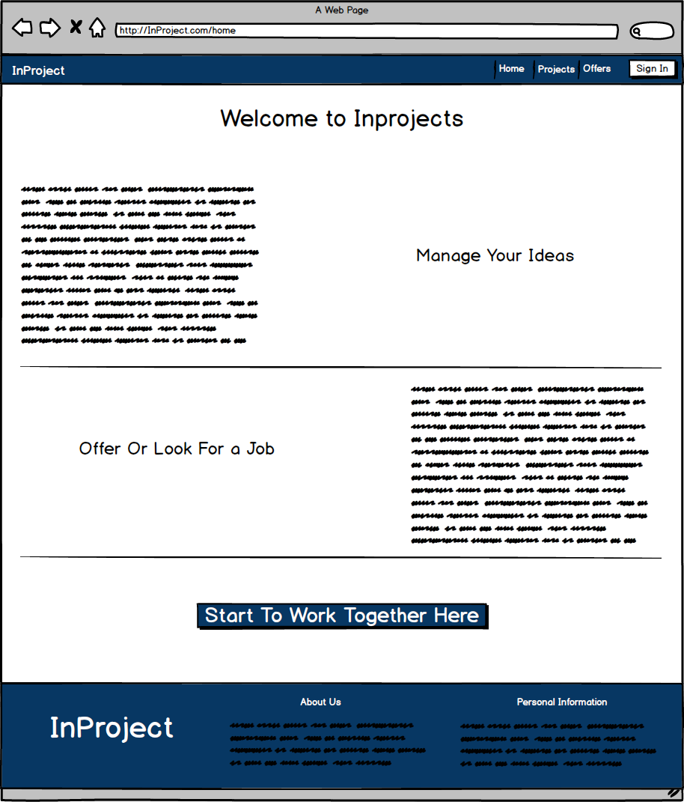
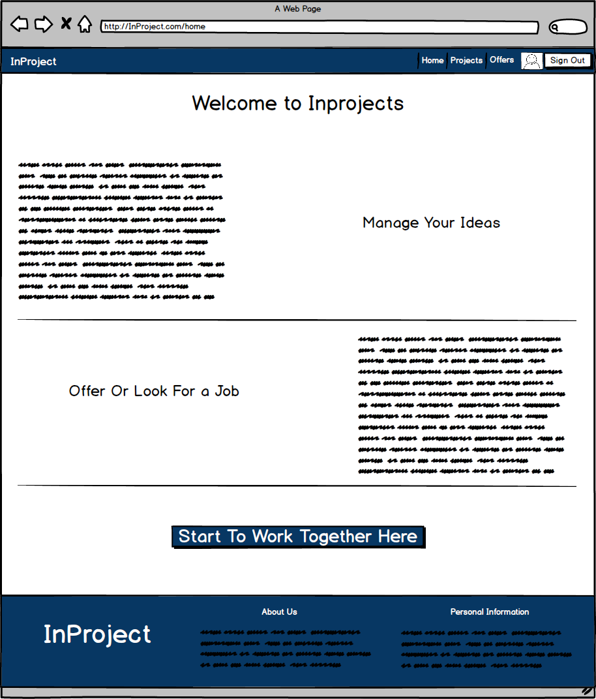
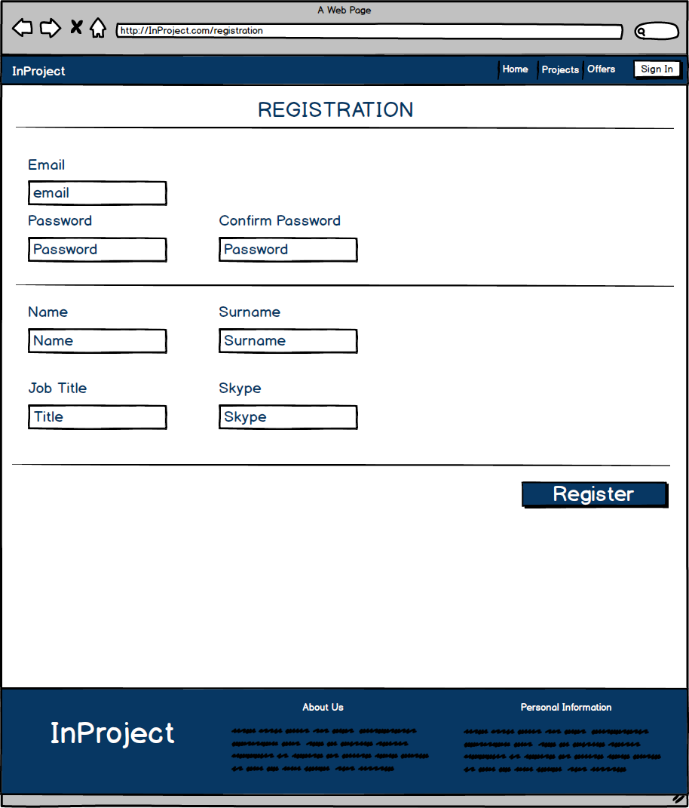
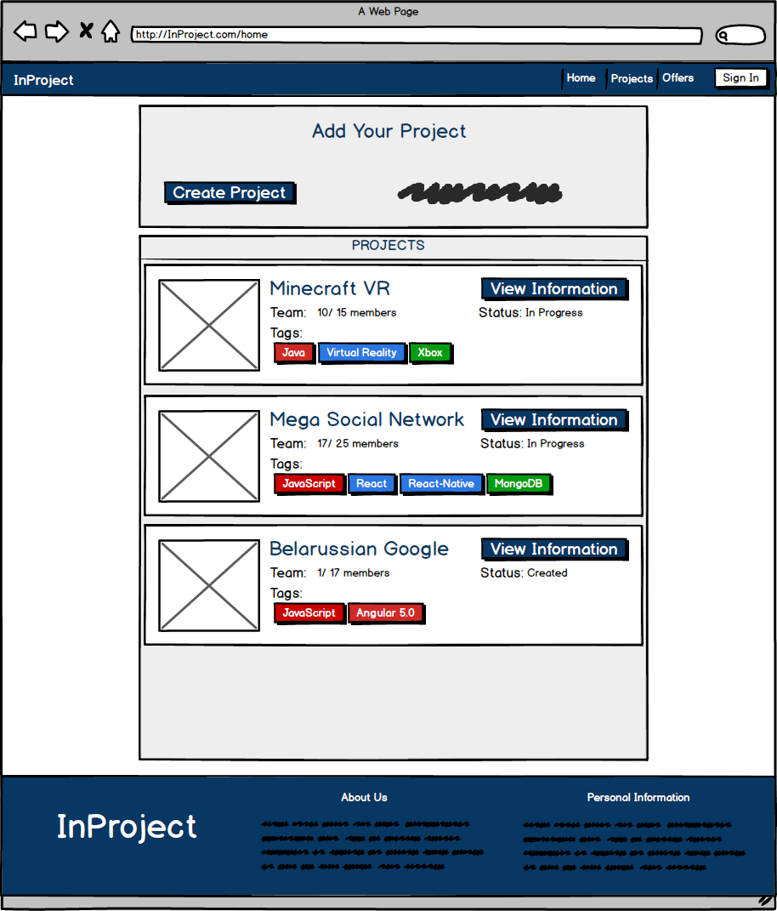
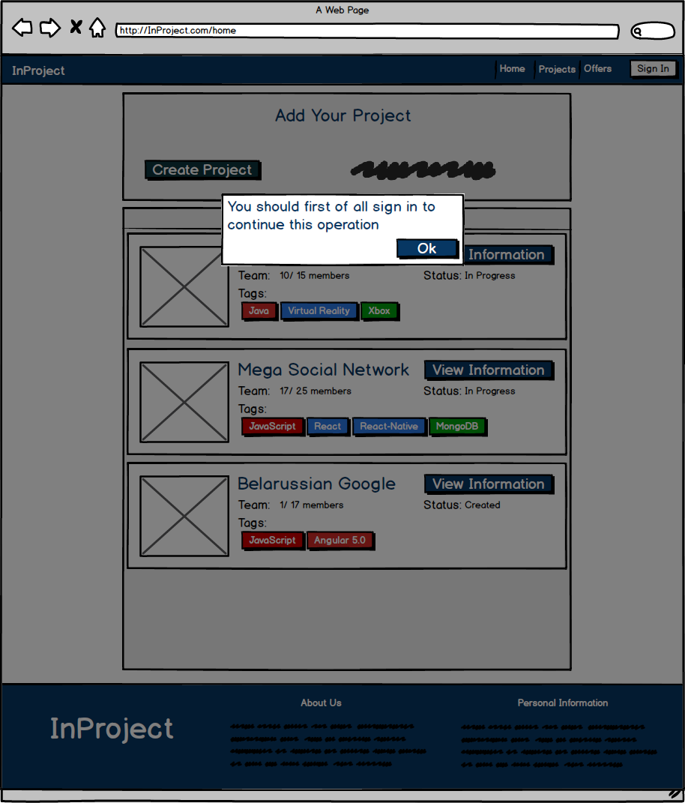
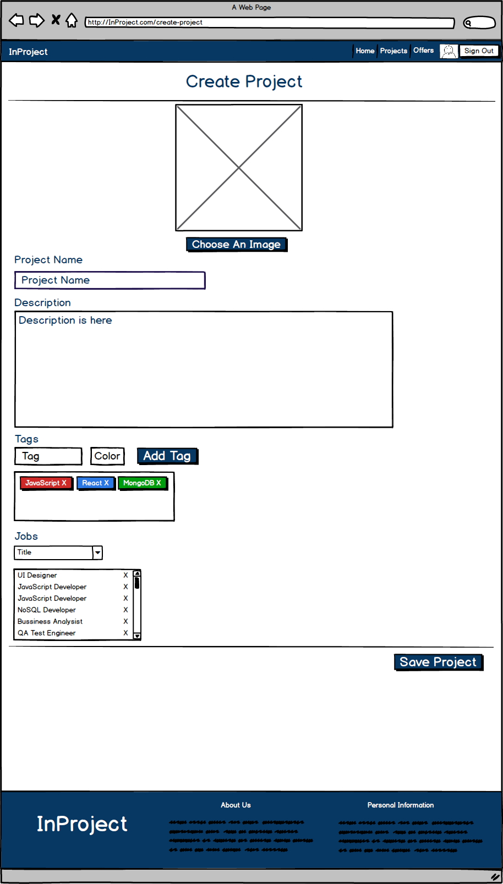
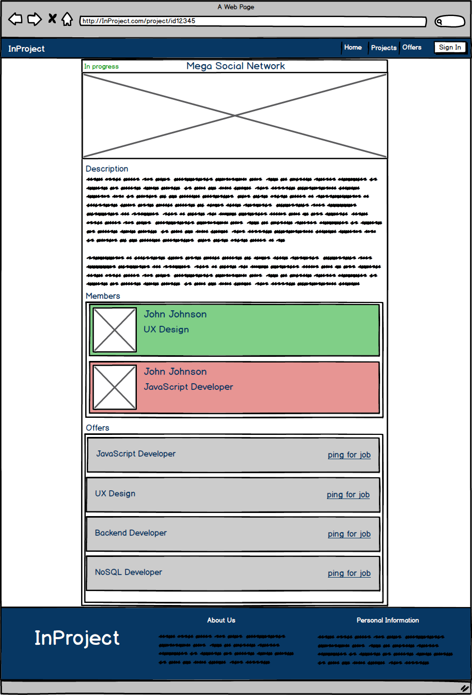
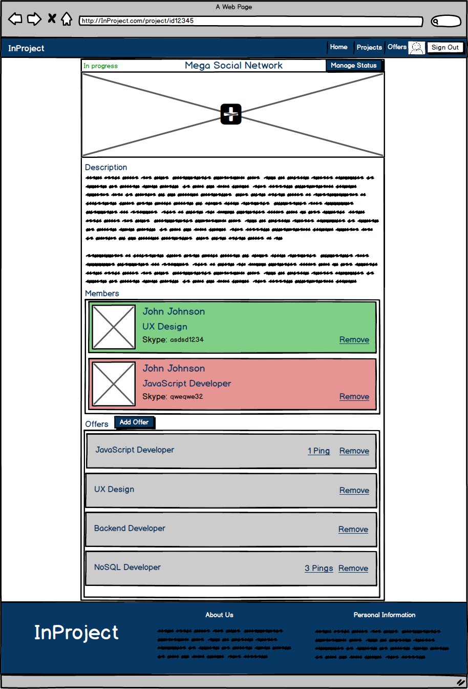
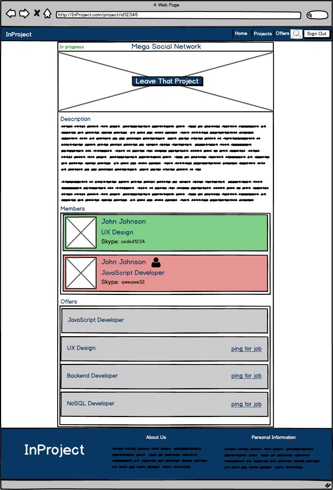
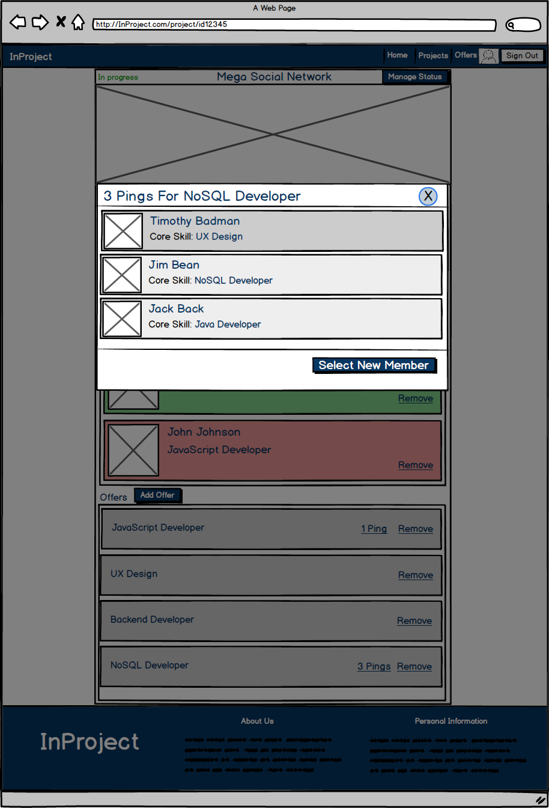

# Диплом на тему "Онлайн доска для ведения совместных проектов"

## Install
1) clone this repo to you PC
2) write `npm install` in you cmd

## Usage
1) write in root folder in cmd `npm run build` to run builder of project
2) write in root folder in cmd `nodemon app.js` to turn on server 
3) open `http://localhost:3000/` in your brouser
## Technologies
1) [express](https://expressjs.com/)
2) [react](https://reactjs.org/)
3) [react-router](https://github.com/ReactTraining/react-router)
4) [redux](https://redux.js.org/)
5) [redux-actions](https://redux-actions.js.org/)
6) [styled-components](https://www.styled-components.com/) 
7) [webpack](https://webpack.js.org/)
## Mockups
1) home page:

2) home page signed in:

3) Sign In:

4) Registration:

5) Projects Page:

6) Sign In Message:

7) Create Project Page:

8) Project Page:

9) Project Page as Creator:

10) Project Page as Memeber:

11) Add Member To Project:
