# Диплом на тему "Онлайн доска для ведения совместных проектов"

## Install
1) clone this repo to you PC
2) write `npm install` in you cmd

## Usage
1) write in root folder in cmd `npm run build` to run builder of project
2) write in root folder in cmd `nodemon app.js` to turn on server 
3) open `http://localhost:3000/` in your brouser
## Technologies
1) [express](https://expressjs.com/)
2) [react](https://reactjs.org/)
3) [react-router](https://github.com/ReactTraining/react-router)
4) [redux](https://redux.js.org/)
5) [redux-actions](https://redux-actions.js.org/)
6) [styled-components](https://www.styled-components.com/) 
7) [webpack](https://webpack.js.org/)

## Backend Install
1) go to https://www.mongodb.com/download-center?jmp=nav#atlas
2) download MongoDB Atlas and MongoDB Compass

## Mockups And Spec
1) home page:

A) 
  Кто: Анонимный пользователь
  Что хочет:  Увидеть главую страницу сайта
  Что для этого надо сделать: Зайти на сайт
  Что он увидит:
  1. Шапку с навигационным меню, где есть 3 вкладки: Home, Projects, People.
  2. Кнопка входа в сеть
  3. Описание сути сайта
  4. Кнопка призывающая к использованию услуг сайта
  5. Нижняя панель сайта с информацие о создателе и об идее проекта в кратце.

B) 
  Кто: Анонимный пользователь
  Что хочет:  Зайти на сайт или зарегистрироваться
  Что надо сделать: Нажать кноку входа в сеть в шапке или внизу сайта.
  Что он увидит:
  1. Блок входа в сеть
  2. В нем 2 поля ввода: логин и пароль
  3. Кнопка входа
  4. Кнопка регистрации
  5. Кнопка восстановления пароля

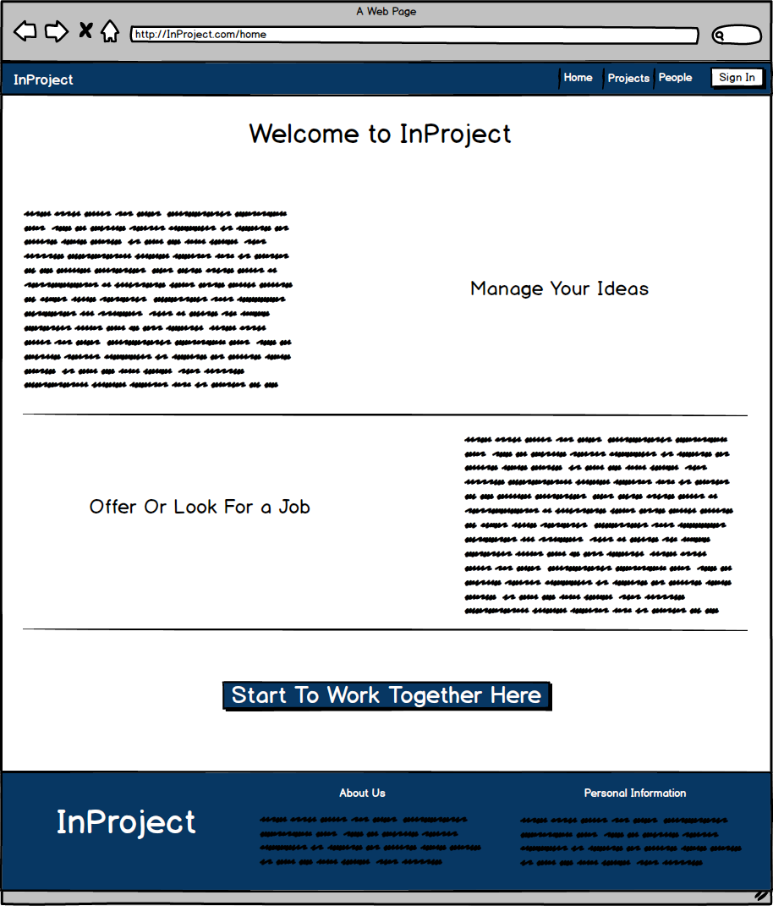
2) home page signed in:

A) 
  Кто: Залогиненый пользователь
  Что хочет:  Увидеть главую страницу сайта
  Что для этого надо сделать: Зайти на сайт
  Что он увидит:
  1. Шапку с навигационным меню, где есть 3 вкладки: Home, Projects, People.
  2. Кнопка выхода из сети
  3. Свою фотографию в шапке
  4. Описание сути сайта
  5. Кнопка призывающая к использованию услуг сайта
  6. Нижняя панель сайта с информацие о создателе и об идее проекта в кратце.

3) Sign In:

A) 
  Кто: Анонимный пользователь
  Что хочет:  Зайти в сеть сайта
  Что для этого надо сделать: 
  1. Ввести логин и пароль
  2. Нажать кнопку входа
  Что он увидит:
  1. В случае успеха перезапуск страницы
  2. В случае ошибки модальное окно закроется.

Б)
  Кто: Анонимный пользователь
  Что хочет:  Зарегистрироваться 
  Что для этого надо сделать: Нажать кнопку регистрации
  Что он увидит:
  1. Страницу регистрации

С)
  Кто: Анонимный пользователь
  Что хочет:  Восстановить пароль 
  Что для этого надо сделать: Нажать кнопку восстановления пароля
  Что он увидит:
  1. Блок с восстановлением пароля через почту и написанием нового пароля

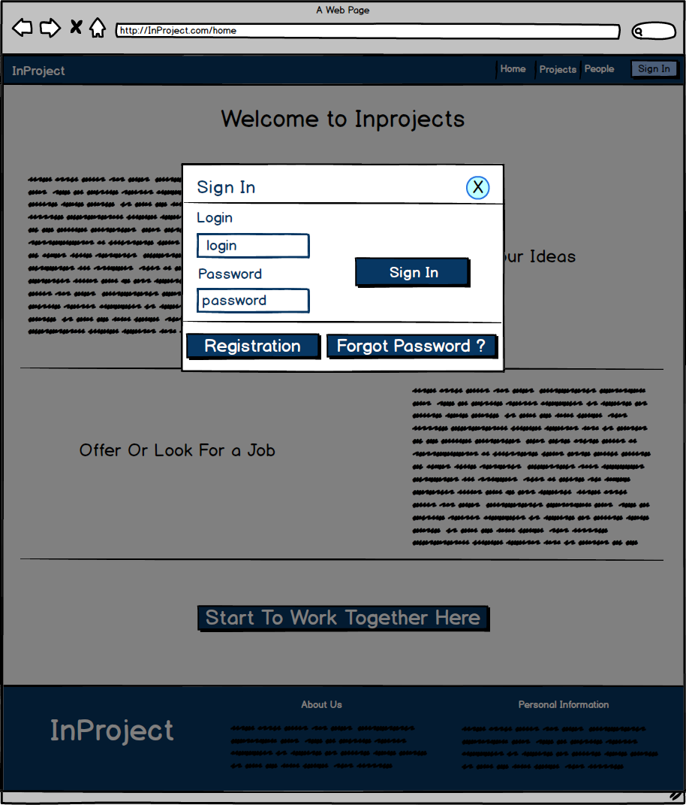
4) Registration:

A) 
  Кто: Анонимный пользователь
  Что хочет:  Зарегистироваться 
  Что видит: 
  1. Поля для заполнения почты и пароля
  2. Поля для заполнения персональных данных.
  3. Поля для заполнения социальных сетей.
  4. Кнопку регистрации
  Что для этого надо сделать: 
  1. Ввести почту
  2. Ввести пароль и подтвердить его
  3. Ввести свои персональные данные: Имя, Фамилия и Профессия
  4. Ввести данные по социальным сетям: Скайп, Гитхаб, Фейсбук.
  5. Нажать кнопку регистрации 
  Что он увидит:
  1. В случае успеха вернется на страницу, на которой был
  2. В случае неверных данных ему предложат все ввести заново.

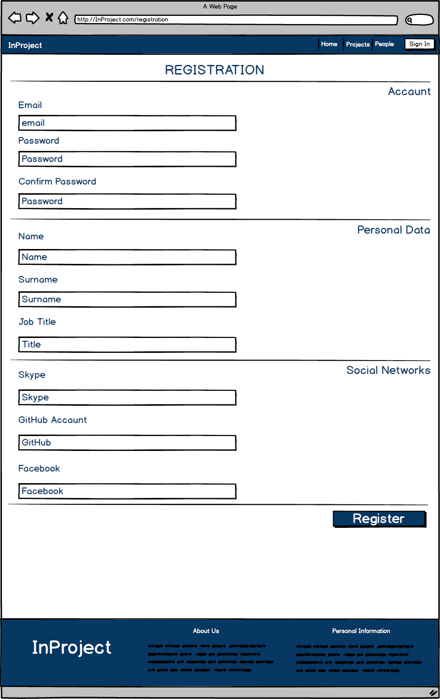
5) Profile Page Owner:

A) 
  Кто: Зарегистрированный пользователь
  Что хочет: увидеть свой профиль
  Что для этого надо сделать: Зайти на свой профиль нажав на иконку своей фотографии в шапке сайта.
  Что он увидит:
  1. Свое фото которое он может обновить по клику.
  2. Свое имя и фамилию
  3. Свой главный навык.
  4. Свои данные по социальным сетям:  почта, скайп, гитхаб аккаунт, фейсбук.
  5. Список активных проектов.
  6. Список истории проектов

Б)
  Кто: Зарегистрированный пользователь
  Что хочет: изменить свой профиль
  Что для этого надо сделать: 
  1. Обновить фотографию.
  2. Измнить свой базовый навык.
  3. Изменить данные по социальным сетям.
  Что он увидит:
  1. В случае успеха измененные данные на своей странице.

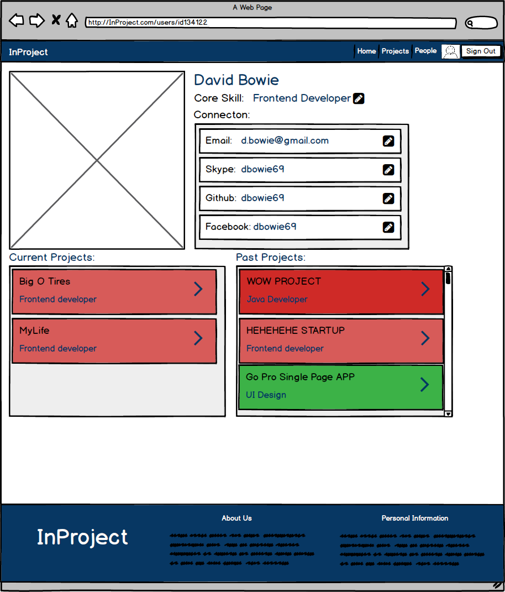
6) Profile Page User:
  
A) 
  Кто: Любой пользователь
  Что хочет: увидеть чужой профиль
  Что для этого надо сделать: Зайти на чужой профиль введя ссылку или зайти на профиль со страницы People.
  Что он увидит:
  1. Фото пользователя.
  2. Имя и фамилию пользователя
  3. Базовый навык пользователя.
  4. Данные по социальным сетям:  почта, скайп, гитхаб аккаунт, фейсбук.
  5. Список активных проектов.
  6. Список истории проектов.

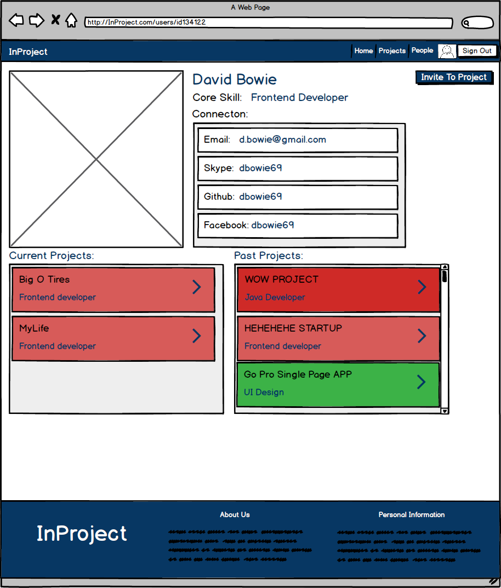
7) Projects Page:

A) 
  Кто: Незарегистрированный пользователь. 
  Что хочет: увидеть страницу проектов.
  Что для этого надо сделать: Нажать на вкладку Projects/
  Что он увидит:
  1. Блок с общей информацией.
    1.1. Надпись "Add Your Project".
    1.2. Кнопку для входа в сеть.
    1.3. Текст с описанием.
  2. Блок с поиском.
    2.1. Поле для ввода названия проекта.
    2.2. Блок перед полем с выбранными фреймворками.
    2.3. Значок поиска.
    2.4 Фильтры статуса проекта и состава команды.
  3. Блок со списком проектов.
    3.1. Надпись Projects.
    3.2. Список проектов, каждый из которых содержит:
      3.2.1. Фото проекта.
      3.2.2. Название проккта.
      3.2.3. Количество участников проекта.
      3.2.4. Вспомогательные тэги проекта.
      3.2.5. Кнопку с переходом на страницу этого проекта.
      3.2.6. Статус проекта.

Б) 
  Кто: Незарегистрированный пользователь. 
  Что хочет: создать проект.
  Что для этого надо сделать: Нажать на кнопку 'Sign In For Creating'
  Что он увидит: форма с входом и регистрацией.

В)
  Кто: Незарегистрированный пользователь. 
  Что хочет: увидеть страницу проекта.
  Что для этого надо сделать: Нажать на кнопку 'View Information' на блоке проекта.
  Что он увидит: Переход на страницу проекта.

Г)
  Кто: Незарегистрированный пользователь. 
  Что хочет: начать поиск по тэгам.
  Что для этого надо сделать: Нажать на любой тэг проекта.
  Что он увидит: В поиск добавиться тэг.

Д)
  Кто: Незарегистрированный пользователь. 
  Что хочет: убрать поиск по тэгам.
  Что для этого надо сделать: Нажать на крестик любого тэга в поиске.
  Что он увидит: В поиск исчезнет тэг.

E)
  Кто: Незарегистрированный пользователь. 
  Что хочет: начать поиск по названию.
  Что для этого надо сделать: Написать любой текст в поиске.
  Что он увидит: Появиться новый список проектов.

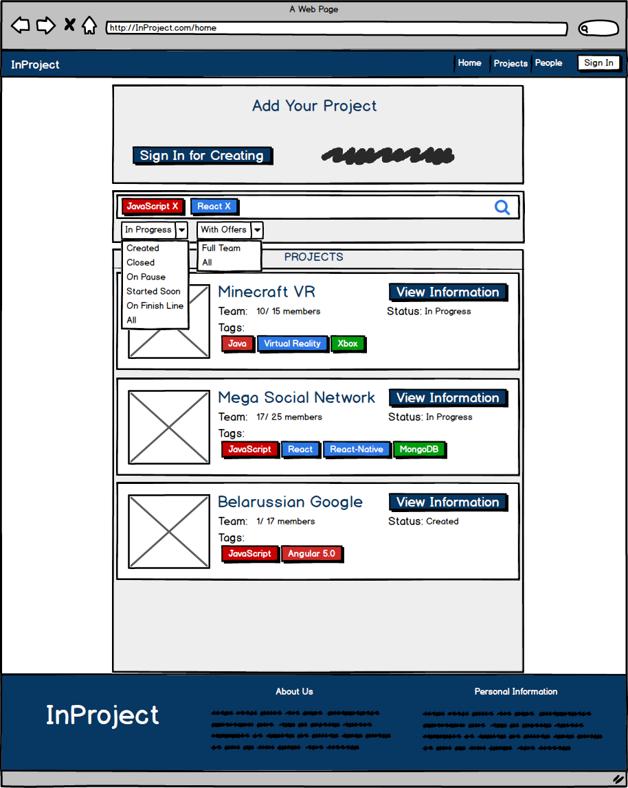
8) Projects Page Signed In:

A) 
  Кто: Зарегистрированный пользователь. 
  Что хочет: увидеть страницу проектов.
  Что для этого надо сделать: Нажать на вкладку Projects/
  Что он увидит:
  1. Блок с общей информацией.
    1.1. Надпись "Add Your Project".
    1.2. Кнопку для входа в сеть.
    1.3. Текст с описанием.
  2. Блок с поиском.
    2.1. Поле для ввода названия проекта.
    2.2. Блок перед полем с выбранными фреймворками.
    2.3. Значок поиска.
    2.4 Фильтры статуса проекта и состава команды.
  3. Блок со списком проектов.
    3.1. Надпись Projects.
    3.2. Список проектов, каждый из которых содержит:
      3.2.1. Фото проекта.
      3.2.2. Название проккта.
      3.2.3. Количество участников проекта.
      3.2.4. Вспомогательные тэги проекта.
      3.2.5. Кнопку с переходом на страницу этого проекта.
      3.2.6. Статус проекта.

Б) 
  Кто: Зарегистрированный пользователь. 
  Что хочет: создать проект.
  Что для этого надо сделать: Нажать на кнопку 'Create Project'
  Что он увидит: пользователя перекинет на страницу создания проекта.

В)
  Кто: Зарегистрированный пользователь. 
  Что хочет: увидеть страницу проекта.
  Что для этого надо сделать: Нажать на кнопку 'View Information' на блоке проекта.
  Что он увидит: Переход на страницу проекта.

Г)
  Кто: Зарегистрированный пользователь. 
  Что хочет: начать поиск по тэгам.
  Что для этого надо сделать: Нажать на любой тэг проекта.
  Что он увидит: В поиск добавиться тэг.

Д)
  Кто: Зарегистрированный пользователь. 
  Что хочет: убрать поиск по тэгам.
  Что для этого надо сделать: Нажать на крестик любого тэга в поиске.
  Что он увидит: В поиск исчезнет тэг.

E)
  Кто: Зарегистрированный пользователь. 
  Что хочет: начать поиск по названию.
  Что для этого надо сделать: Написать любой текст в поиске.
  Что он увидит: Появиться новый список проектов.

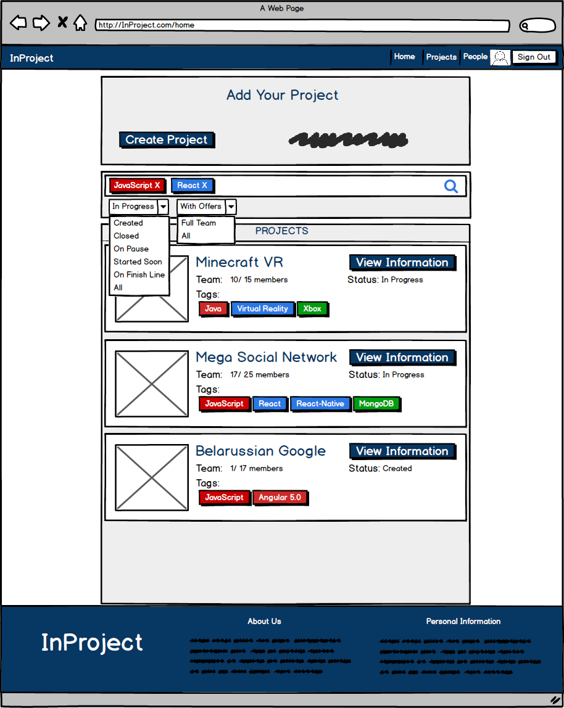
9) Create Project Page:

A)
  Кто: Зарегистрированный пользователь. 
  Что хочет: создать проект.
  Что он видит:
  1. Фото проекта
  2. Кнопку добавить фото проекта.
  3. Поле с заполнением имени  проекта.
  4. Поле с описанием проекта.
  5. Поля с добавлением ссылки на гитхаб и фейсбук.
  6. Тэги для проекта и их заполнение.
  7. Кнопку для добавления тэга.
  8. Блок с выбранными тэгами. ( у любого тэга есть крестик, его можно удалить по нажатию на крестик)
  9. Поле с добавлением профессии.
  10. Список необходимых профессий. ( у любой профессии в списке будет крести, ее можно удалить по нажатию на крестик)
  11. Кнопку сохранить проект.
  Что для этого надо сделать: 
  1. Заполнить все поля.
  2. Нажать на кнопку 'Save Project'.
  Что он увидит: Переход на страницу проекта.

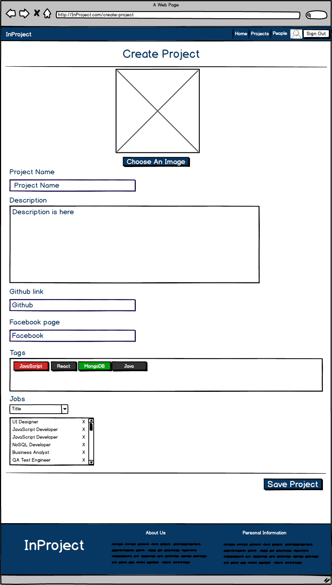
10) Any Project Page:

A)
  Кто: Незарегистрированный пользователь. 
  Что хочет: увидеть информацию о проекте.
  Что для этого надо сделать: 
  1. Ввести урл проекта в браузере или нажать на кнопку на кнопку 'View Information' на блоке проекта на странице Projects
  Что он увидит:
  1. Фото проекта
  2. Статус проекта.
  3. Имя проекта.
  4. Описание проекта.
  5. Ссылки на гитхаб и фейсбук.
  6. Количество участников.
  7. Список участников.
  8. Блок со списоком всех предложений на проект.

Б) 
  Кто: Незарегистрированный пользователь 
  Что хочет: поучаствовать в проекте.
  Что для этого надо сделать: нажать на кнопку 'ping for job' на интересующей профессии.
  Что он увидит: Сообщение, что предложение  отправлено успешно.

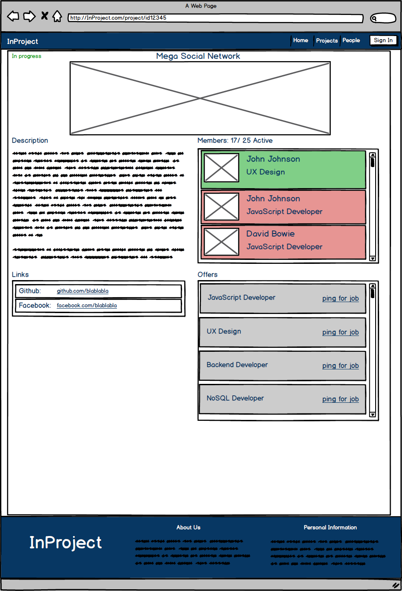
11) Any Project Page Admin View:

A)
  Кто: Зарегистрированный пользователь и одновременно владелец проекта. 
  Что хочет: увидеть информацию о проекте.
  Что для этого надо сделать: 
  1. Ввести урл проекта в браузере или нажать на кнопку на кнопку 'View Information' на блоке проекта на странице Projects
  Что он увидит:
  1. Фото проекта и кнопку редактирования.
  2. Статус проекта.
  3. Имя проекта.
  4. Описание проекта  и кнопку редактирования.
  5. Ссылки на гитхаб и фейсбук  и кнопку редактирования.
  6. Количество участников.
  7. Список участников.
    7.1. Профессии участников.
    7.2. Кнопки увольнения участников.
  8. Блок со списоком всех предложений на проект.
    8.1. Название профессии и ее редактирование.
    8.2. Количество заинтересованных лиц в должности.
    8.3. Кнопку удаления профессии.
  9. Кнопки управления статусом проекта.

Б) 
  Кто: Зарегистрированный пользователь и одновременно владелец проекта. 
  Что хочет: изменить инофрмацию проекта.
  Что для этого надо сделать: отредактировать нужные поля.
  Что он увидит:
  1. Проект с обновленной инофрмацией.

В) 
  Кто: Зарегистрированный пользователь и одновременно владелец проекта. 
  Что хочет: уволить участника проекта.
  Что для этого надо сделать: нажать кнопку удалить участника в блоке участника.
  Что он увидит:
  1. Список участников без удаленного.

С) 
  Кто: Зарегистрированный пользователь и одновременно владелец проекта. 
  Что хочет: удалить должность проекта.
  Что для этого надо сделать: нажать кнопку минус в блоке должности.
  Что он увидит:
  1. Список профессий без удаленного.

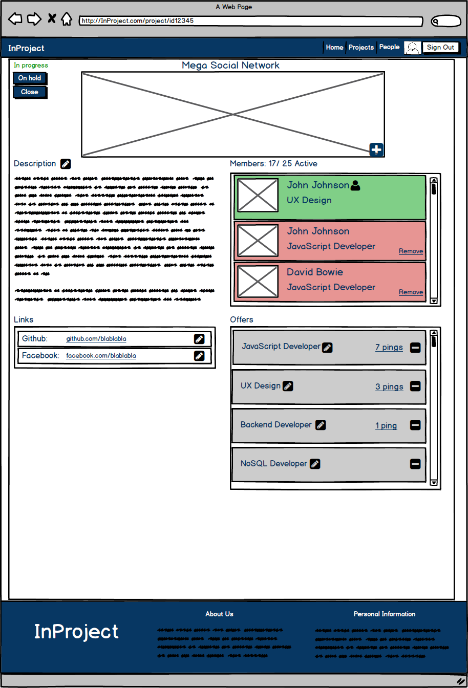
12) Add Worker on project page:

A)
  Кто: Зарегистрированный пользователь и одновременно владелец проекта. 
  Что хочет: увидеть информацию о желающийх на должность.
  Что для этого надо сделать: 
  1. Нажать на кнопку 'N ping(s)'.
  Что он увидит:
  1. Список желающих на должность.
    1.1. Фото желающего
    1.2. Имя желающего.
    1.3. Базовый навык желающего.
  2. Кнопку крестик для отмены выбора.
  3. Кнопку 'Select New Member'.

Б) 
  Кто: Зарегистрированный пользователь и одновременно владелец проекта. 
  Что хочет: выбрать человека на должность.
  Что для этого надо сделать: 
  1. Нажать на элемент в списке.
  2. Нажать на кнопку 'Select New Member'.
  Что он увидит:
  1. Обновленный список участников.

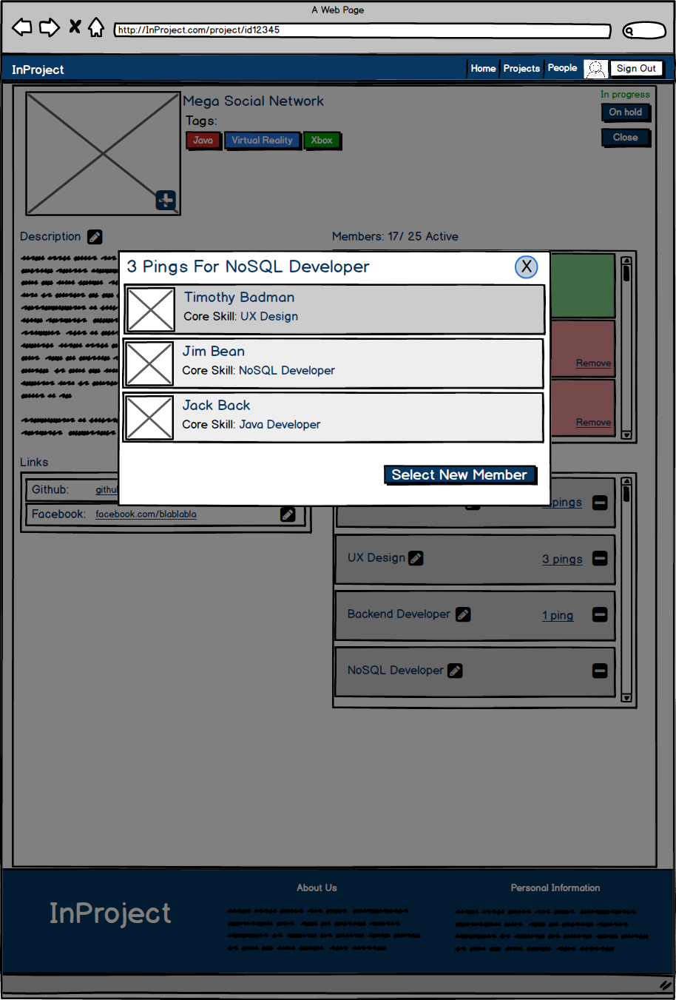
13) Any Project Page Member View:

A)
  Кто: Зарегистрированный пользователь. 
  Что хочет: увидеть информацию о проекте.
  Что для этого надо сделать: 
  1. Ввести урл проекта в браузере или нажать на кнопку на кнопку 'View Information' на блоке проекта на странице Projects
  Что он увидит:
  1. Фото проекта.
  2. Статус проекта.
  3. Имя проекта.
  4. Описание проекта.
  5. Ссылки на гитхаб и фейсбук.
  6. Количество участников.
  7. Список участников.
    7.1. Профессии участников.
    7.2. Кнопки увольнения участников.
    7.3. Значок что он участник проекта, если так и есть.
    7.4. Кнопку с уходом из проекта.
  8. Блок со списоком всех предложений на проект.
    8.1. Название профессии.
    8.2. Количество заинтересованных лиц в должности.

Б)
  Кто: Зарегистрированный пользователь. 
  Что хочет: уйти из проекта.
  Что для этого надо сделать: 
  1. Нажать на кнопку ухода из проекта в своем блоке.
  Что он увидит:
  1. Проект без его участия.

В)
  Кто: Зарегистрированный пользователь. 
  Что хочет: посмотреть на заинтерисованных людей в проекте.
  Что для этого надо сделать: 
  1. Нажать на кнопку 'N ping(s)'.
  Что он увидит:
  1. Список добровольцев в модальном окне.

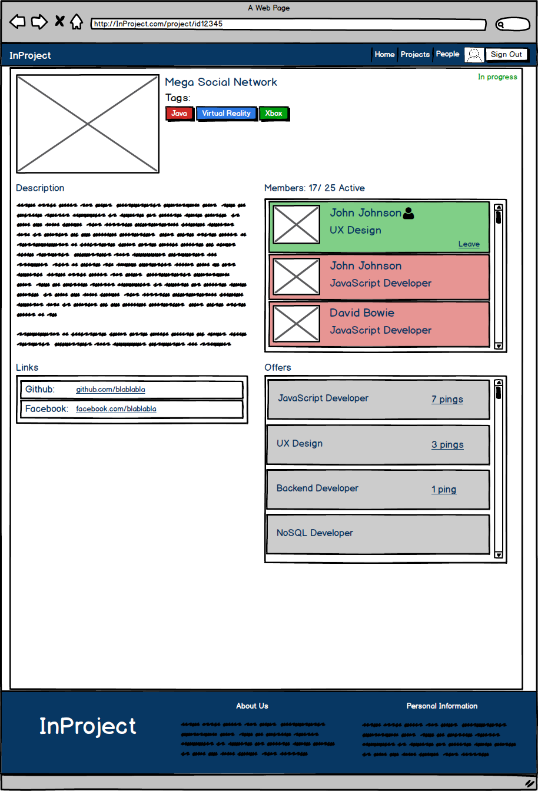
14) People Page:

A) 
  Кто: Анонимный пользователь. 
  Что хочет: посмотреть на людей на сайте.
  Что для этого надо сделать: 
  1. Нажать на ссылку в шапке 'People'.
  Что он увидит:
  1. Блок с поиском.
    1.1. Блоки с тэгами базовых навыков.
    1.2. Поле ввода имени или фамилии чувака.
    1.3. Значок поиска.
  2. Блок с людьми на сайте.
    2.1. Название блока 'People'/
    2.2. Список с блоками с информацией о людях.
      2.2.1. Фото человека.
      2.2.2. Его имя и фамилия.
      2.2.3. Базовый навык.
      2.2.4. Список активных проектов.
      2.2.5. Кнопку посмотреть профиль.

Б) 
  Кто: Анонимный пользователь. 
  Что хочет: посмотреть на профиль человека.
  Что для этого надо сделать: 
  1. Нажать на кнопку 'Look Profile' в блоке о человеке.
  Что он увидит:
  1. Страницу пользователя

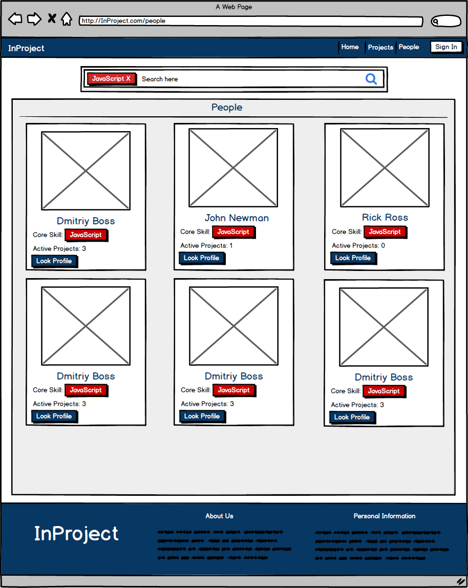
15) People Page Signed In User:
A) 
  Кто: Зарегистрированный пользователь. 
  Что хочет: посмотреть на людей на сайте.
  Что для этого надо сделать: 
  1. Нажать на ссылку в шапке 'People'.
  Что он увидит:
  1. Блок с поиском.
    1.1. Блоки с тэгами базовых навыков.
    1.2. Поле ввода имени или фамилии чувака.
    1.3. Значок поиска.
  2. Блок с людьми на сайте.
    2.1. Название блока 'People'/
    2.2. Список с блоками с информацией о людях.
      2.2.1. Фото человека.
      2.2.2. Его имя и фамилия.
      2.2.3. Базовый навык.
      2.2.4. Список активных проектов.
      2.2.5. Кнопку посмотреть профиль.
      2.2.6. Кнопку 'Invite', если у самого есть собственные прокты.

Б) 
  Кто: Зарегистрированный пользователь. 
  Что хочет: посмотреть на профиль человека.
  Что для этого надо сделать: 
  1. Нажать на кнопку 'Look Profile' в блоке о человеке.
  Что он увидит:
  1. Страницу пользователя

В) 
  Кто: Зарегистрированный пользователь. 
  Что хочет: позвать человека в проект.
  Что для этого надо сделать: 
  1. Нажать на кнопку 'Invite' в блоке о человеке.
  Что он увидит:
  1. Модальное окно
    1.1. Кнопка крестик, которая отменяет приглашение в проект.
    2.2. Блок со своими проектами.
      2.2.1. Кнопки 'влево' и 'вправо' для выбора проекта
      2.2.2. Название проекта.
    2.3. Список должностей.
      2.3.1. Блок с названием должности.
    2.4. Кнопка 'Send Invite'

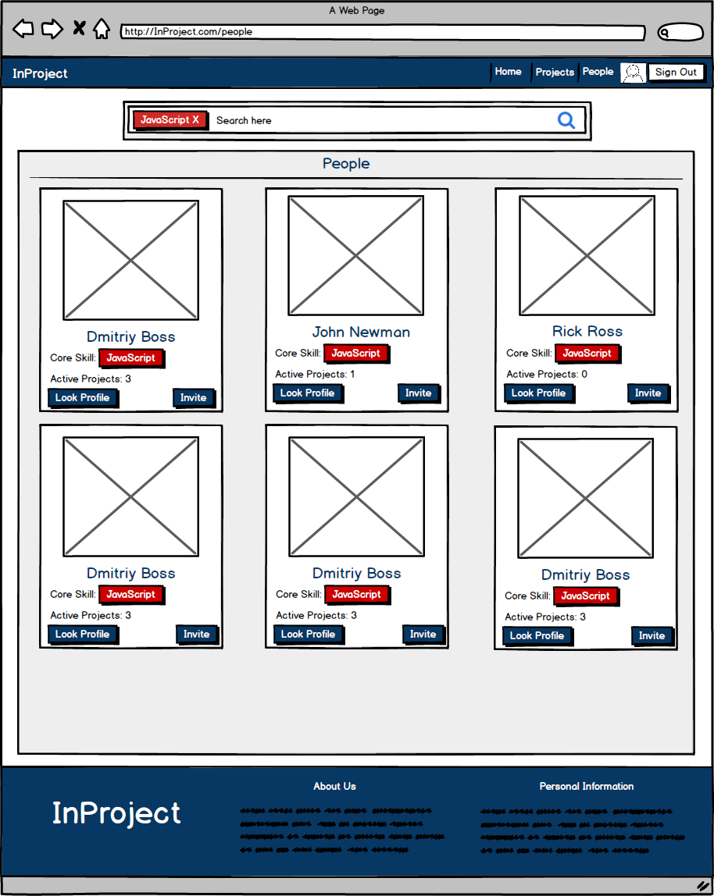
16) Invite View:

A) 
  Кто: Зарегистрированный пользователь. 
  Что хочет: позвать человека в проект на выбранную должность.
  Что для этого надо сделать: 
  1. Выбрать проект.
  2. Выбрать должность.
  3. Нажать кнопку 'Send Invite'.
  Что он увидит:
  1. Модальное окно закрывается.
  2. Сообщение о том, что приглашение отослано.

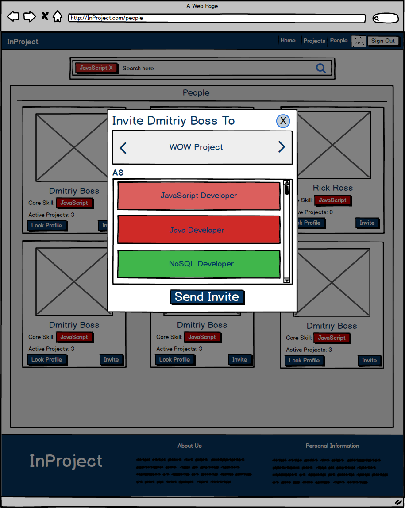